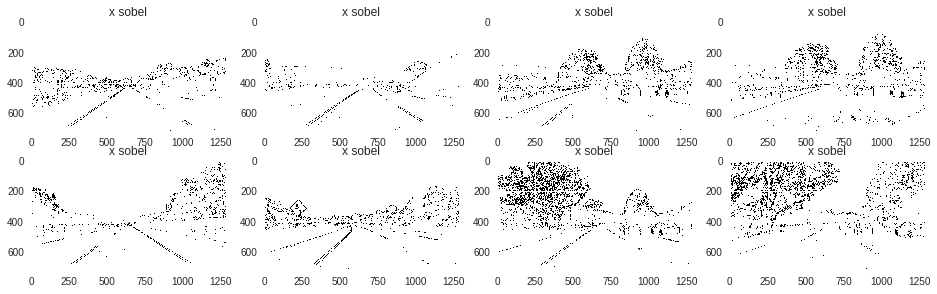

# Advanced-Lane-Lines-Detection
This CND course project aims to detect lane lines in a video file captured by a front-facing camera in a car.

# The Pipeline to detect lane lines
Here is my final pipeline: image -> lens distortion correction -> perspective to top-down view transformation -> combined color (S channel) and gradient (sobel x) thresholding -> find lane lines -> plot lane lines on the top-down view -> transorm the top-down view back to perspective -> combine annotations and lane line plot with the original image (distortion-corrected version)

## Application on the project video


|[YouTube HD Link](https://youtu.be/ZqMAmVXGFYA)|
|:-------------:|


# Camera calibration
Due to lens distortion, prior to determining metrics from images we need to correct image distortions. I used OpenCV commands: `calibrateCamera` for this purpose. The calibration step is packaged into a python helper function: `calibrate_cam`, which returns necessary parameters to correct lens distortions.

## Determine camera parameters
```python
# pipeline function: camera calibration
def calibrate_cam(files_path, grid_shape=(9, 6), cam_shape=(720, 1280)):
    # prepare object points, like (0,0,0), (1,0,0), (2,0,0) ....,(6,5,0)
    objp = np.zeros((grid_shape[1]*grid_shape[0],3), np.float32)
    objp[:,:2] = np.mgrid[0:grid_shape[0], 0:grid_shape[1]].T.reshape(-1,2)

    # Arrays to store object points and image points from all the images.
    objpoints = [] # 3d points in real world space
    imgpoints = [] # 2d points in image plane.
    
    for file in os.listdir(files_path):
        img = cv2.imread(files_path + file)
        gray = cv2.cvtColor(img, cv2.COLOR_BGR2GRAY)
        
        # Find the chessboard corners
        ret, corners = cv2.findChessboardCorners(gray, grid_shape, None)
        
        if ret == True:
            objpoints.append(objp)
            imgpoints.append(corners)

    ret, mtx, dist, rvecs, tvecs = cv2.calibrateCamera(objpoints, imgpoints, cam_shape[::-1], None,None)
    return ret, mtx, dist, rvecs, tvecs
```

### Example result


# Perspective transformation
Since the camera records images in perspective view, it is useful to transform the image first to a top-down view using perspective transformation functions in OpenCV so that real-world metrics can be extracted from the image easily.

I used OpenCV `warpPerspective` function to achieve this purpose.

### Example result


# Locate lane lines using combined thresholding
To make later pipeline steps easier, I isolate lane lines region in an image using a both color and gradient thresholding.

## Color thresholding

### 's' Channel


### 'l' Channel


### 'h' Channel


Tests show that the 'S' and 'L' channels make the best result for identifying lane lines. 

## Gradient thresholding
Sobel gradient along x-direction is good at picking up vertical lines.
### 'sobel x' gradient


I experimented different gradient based on x-direction, magnitude and direction. My tests show that sobel thresholding along the x axis and the magnitude are doing a good job at separating lane lines.

Finally, I combined color thresholding and gradient thresholding as follows:
```python
# threshold values are tuned by trial-and-error method.
def comb_select(img, s_thresh=(128, 255), l_thresh=(64, 255), g_thresh=(30, 255), sobel_kernel=5):
    # create color thresholding mask
    chan_map = {'h': 0, 'l': 1, 's': 2}
    hls = cv2.cvtColor(img, cv2.COLOR_RGB2HLS)
    chan_sel_s = hls[:, :, chan_map['s']]

    s_bin = np.zeros_like(chan_sel_s)
    s_bin[(chan_sel_s >= s_thresh[0]) & (chan_sel_s <= s_thresh[1])] = 1

    chan_sel_l = hls[:, :, chan_map['l']]

    l_bin = np.zeros_like(chan_sel_l)
    l_bin[(chan_sel_l >= s_thresh[0]) & (chan_sel_l <= s_thresh[1])] = 1

    # create gradient thresholding mask
    abs_sobel_x = np.absolute(cv2.Sobel(chan_sel_l, cv2.CV_64F, 1, 0, ksize=sobel_kernel))
    # print("abs max: ", np.amax(abs_sobel), "min: ", np.amin(abs_sobel), "mean: ", np.mean(abs_sobel))

    # Rescale back to 8 bit integer
    scaled_sobel = np.uint8(255 * abs_sobel_x / np.max(abs_sobel_x))
    sx_bin = np.zeros_like(scaled_sobel)
    sx_bin[(scaled_sobel >= g_thresh[0]) & (scaled_sobel <= g_thresh[1])] = 1

    # combine masks
    binary_output = np.zeros_like(scaled_sobel)
    binary_output[((s_bin == 1) & (l_bin == 1) | (sx_bin == 1))] = 1
    binary_output = 255 * np.dstack((binary_output, binary_output, binary_output)).astype('uint8')

    return binary_output
 ```

### Example result of a combined gradient filtering


Note that I also used used a masking technique to keep binary pixels of only the lane line region.

#### Example result


# Determine lane lines
To determine lane lines, I used the sliding windows method mentioned in class. First, a histogram of lower-half image along the column direction is calculated. The two peaks will naturally correspond to left and right lane lines. Second, a series of fixed-size windows are stacked along the column direction and centered at the center of non-zero pixel clusters. The trace of the windows naturally define a lane line. Finally, a second-order polynomial line is fitted to represent a lane line.

Once the lane line is determined using the sliding windows method, searching lanes in the next image stream can be easier: we first search for clusters of nonzero pixels around the lane lines determined in the previous step. If the search makes sense, i.e. fitted lane lines based on those nonzero pixel clusters are consistent with prior history of lane lines, we accept the result. Otherwise, we use the sliding windows method to determine a fresh lane lines for the current image.

* example result


## Determine lane curvature and off-center distances
Because we have the fitted lane lines. Using coefficients of the fitted polynomial lines, the lane curvature and off-center distances are very easy to determine. I used the exact same method mentioned in class.

* example result after annotation


## Using Lane object to track lane lines
I used a Lane object to represent the lane lines. This object caches historical lane line properties and its member variables of lane line properties represent the current lane lines. If a new set of properties for a newly-determined lane line are consistent with the history, the new data is incorporated into the object to update a running average of lane lines properties. Otherwise the new data is discarded and the running average is used to represent lane lines for the current frame.

# Discussion
The biggest challenge is to make this pipeline robust to various lighting conditions. By trial and error, I determined the threshold values for the combined thresholding. However, using a fixed threshold do not work for other video files. I will explore an adaptive method for determining proper threshold values in future. Another challenge is to properly update lane lines after they have been found. I used an empirical criteria to decide whether or not new measurement can be accepted, that is if the newly-determined lane line properties won't explode the standard deviation for a buffer of historial measurements, we accept the new lane lines and add their properties to a buffer. Otherwise, we just use a running average of lane lines. There are a lot to be improved here. A Kalman filter would help to truely track the lane lines. 


